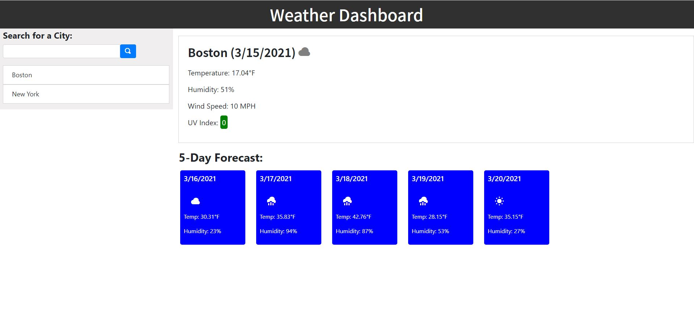

# campbell-weather-dash
 - Created layout, including header and 2 columns
 - Added city search functionality
 - Added localStorage to maintain persistent state across sessions of search history
 - Leveraged Open Weather API to pull current data as well as 5 day forecast
 - Implemented dynamic UV coloring & Weather Symbols based on data
 - Developed click functionality for re-search past searches

 Deployed application can be found at: https://campbefs.github.io/campbell-weather-dash/

  
